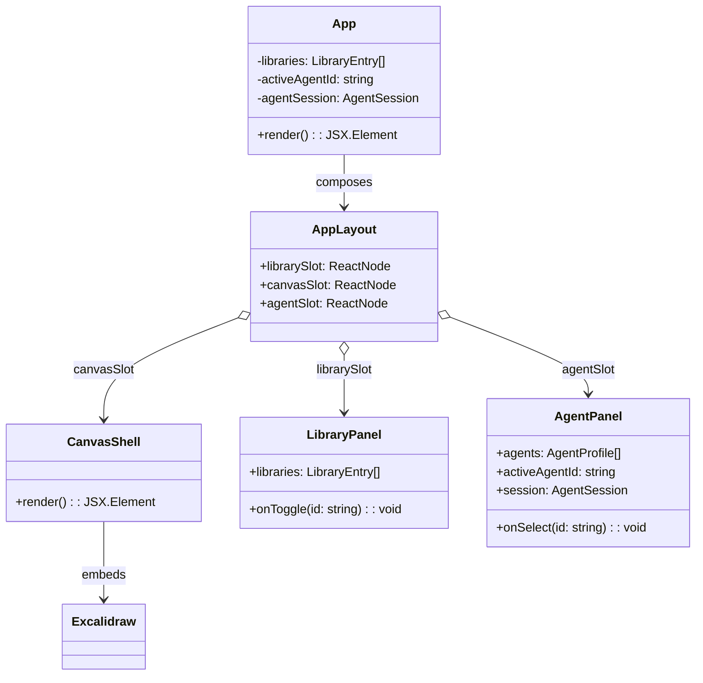
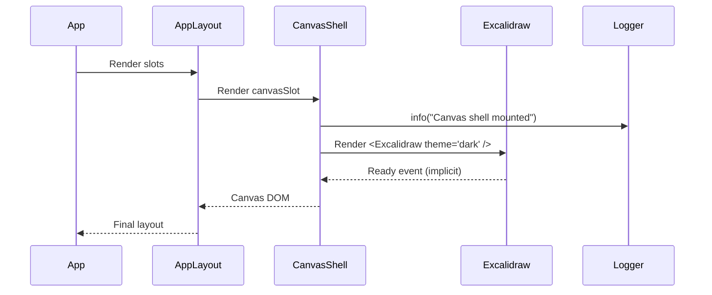
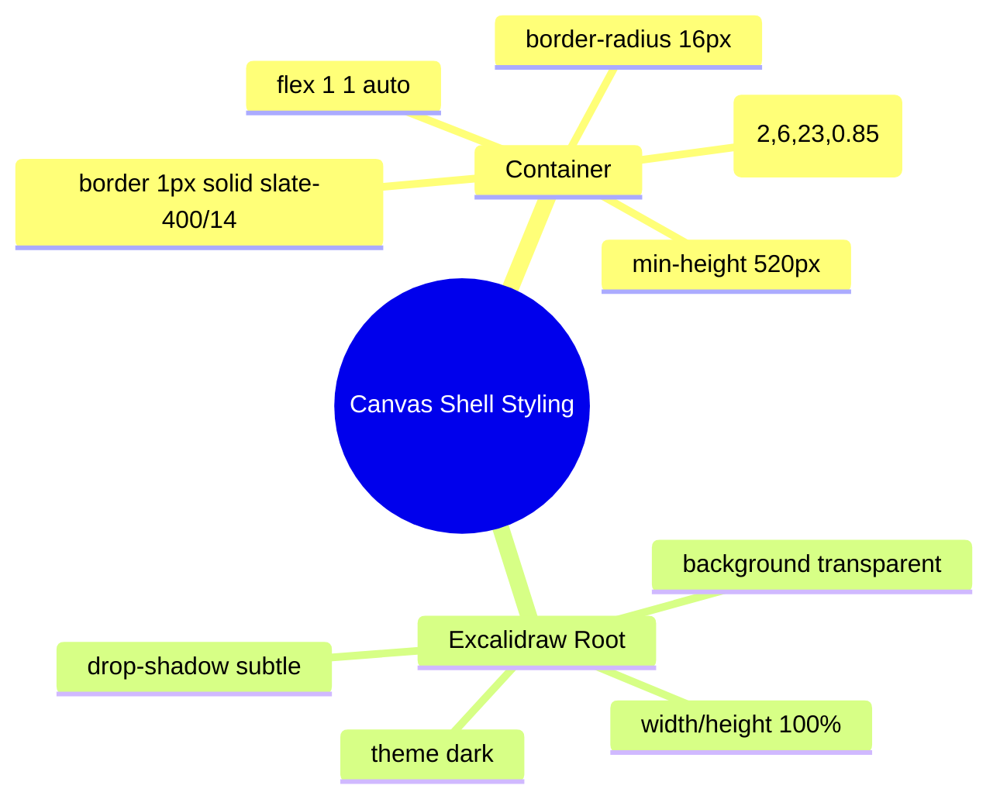

# Excalidraw-First Canvas Migration & AST Alignment (2025-12-31T00:24Z)

## Context & Drivers
- The project previously centered the canvas experience on **tldraw**. Due to licensing changes in tldraw v4, the canvas must pivot to **Excalidraw-only** usage across the app and documentation.
- Current runtime implementation lives in `apps/web`, with the canvas wrapped by `CanvasShell` and composed into `AppLayout` alongside agent and library panels.
- Hybrid Knowledge Graph (hKG) sync could not be performed from this environment (no drivers/credentials available at runtime). The architectural intent is captured here for later synchronization under the project namespace `urn:uuid:7f4c7a4c-9f51-4a78-958b-8d20ad1bd8a1`.

## Baseline AST Snapshot (Pre-Migration)
| File | Key Exports / Declarations | Notes |
|------|----------------------------|-------|
| `apps/web/src/App.tsx` | `App` component | Composes `AppLayout`, `LibraryPanel`, `CanvasShell`, `AgentPanel`; manages state for libraries and active agent. |
| `apps/web/src/components/layout/AppLayout.tsx` | `AppLayout` | Grid layout shell with slots for library/canvas/agent. |
| `apps/web/src/components/canvas/CanvasShell.tsx` | `CanvasShell` | Wraps `<Tldraw>` with logger instrumentation. |
| `apps/web/src/components/panels/LibraryPanel.tsx` | `LibraryPanel` | Lists libraries, toggles enablement. |
| `apps/web/src/components/panels/AgentPanel.tsx` | `AgentPanel` | Agent roster, transcript, composer. |
| `apps/web/src/hooks/useAgentSession.ts` | `useAgentSession` | Manages transcript/composer state per active agent. |
| `apps/web/src/state/agents.ts` | `AGENT_PROFILES`, `getAgentById` | Static agent metadata. |
| `apps/web/src/state/libraries.ts` | `LIBRARIES`, `toggleLibrary` | Library catalogue + toggle helper. |
| `apps/web/src/app.css` | Global styles | Grid layout, panel styling, canvas container overrides (currently tldraw-specific). |

## Target AST (Post-Migration)
| File | Declarations | Responsibility (Excalidraw-centric) |
|------|--------------|--------------------------------------|
| `apps/web/src/components/canvas/CanvasShell.tsx` | `CanvasShell` using `Excalidraw` | Render Excalidraw canvas with dark theme; log mount event; no tldraw imports. |
| `apps/web/src/app.css` | `.canvas-shell`, `.excalidraw` overrides | Ensure Excalidraw fills container, dark background, softened borders. Remove tldraw-specific `.tl-container` rule. |
| `apps/web/package.json` | dependency `@excalidraw/excalidraw` | Remove `@tldraw/tldraw`; align lockfile via `pnpm install`. |
| `docs/*` | Updated language | Communicate Excalidraw-only posture across README/PRD/prompts/architecture. |

## Component Interaction (UML Class Diagram)

## Render Flow (Mermaid Sequence)

## Layout Styling Mindmap

## Migration Steps (High Level)
1. Replace `@tldraw/tldraw` import with `@excalidraw/excalidraw` in `CanvasShell`, keep logger hook.
2. Update `app.css` to style Excalidraw root and remove tldraw-specific selector.
3. Swap dependencies in `apps/web/package.json`, run `pnpm install` to refresh `pnpm-lock.yaml`.
4. Update README, PRD, and prompt docs to state Excalidraw-only canvas.
5. Sync this plan and resulting code to the hybrid knowledge graph (post-run, outside this environment).

## Knowledge Graph Alignment
- Project UUIDv8: `urn:uuid:7f4c7a4c-9f51-4a78-958b-8d20ad1bd8a1`.
- New component node: `Component {name: "CanvasShell", file: "apps/web/src/components/canvas/CanvasShell.tsx", canvas: "Excalidraw"}` linked via `EMBEDS_DEPENDENCY -> Library {name: "@excalidraw/excalidraw"}`.
- Documentation nodes updated to reference Excalidraw as canonical canvas provider.
- **Pending action:** Push these relationships and the updated AST to hKG once connectivity/tools are available.
