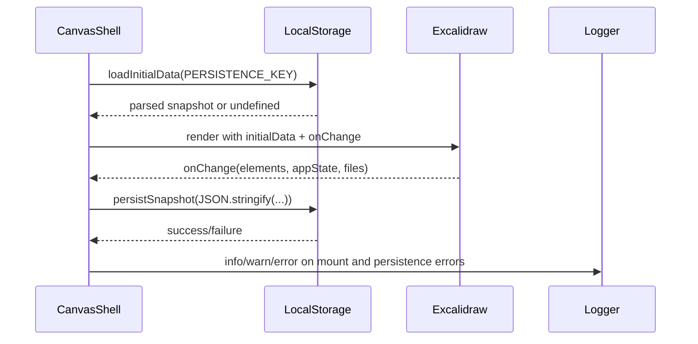
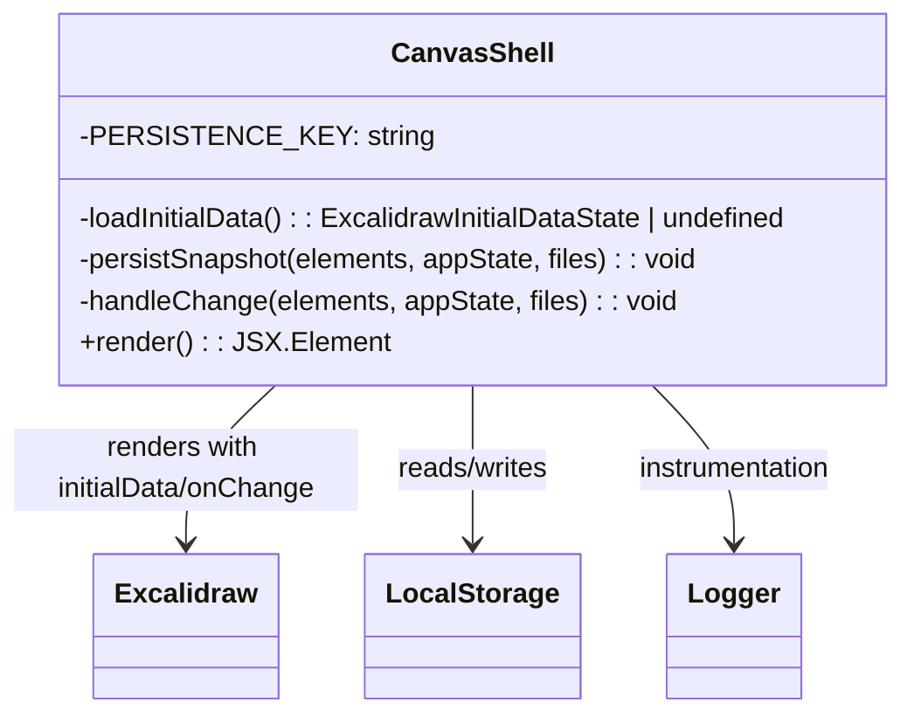

# Excalidraw Canvas Persistence Architecture & AST Update (2025-12-31T01:15Z)

## Context & Problem Statement
- Regression reported: switching from `Tldraw` to `Excalidraw` removed the `persistenceKey` behavior, causing drawings to be lost on refresh because no local storage persistence is wired.
- Goal: Reintroduce client-side persistence for the Excalidraw canvas using localStorage, preserving drawings across reloads without introducing new backend services.
- Scope: `apps/web` only (CanvasShell + styling), documentation touch limited to this architecture note and its companion checklist. Hybrid Knowledge Graph (hKG) sync is **pending** due to unavailable connectivity/tooling in this environment.

## Baseline AST Snapshot (Current)
| File | Key Declarations | Notes |
|------|------------------|-------|
| `apps/web/src/components/canvas/CanvasShell.tsx` | `CanvasShell` | Renders `<Excalidraw>` with dark theme; no persistence wiring. |
| `apps/web/src/app.css` | `.canvas-shell` styles | Container styling for canvas, neutral background. |
| `apps/web/package.json` | dependencies | Uses `@excalidraw/excalidraw` (install blocked by registry 403). |

## Target AST (Post-Persistence)
| File | Declarations | Responsibilities |
|------|--------------|-------------------|
| `apps/web/src/components/canvas/CanvasShell.tsx` | `PERSISTENCE_KEY` constant; helpers `loadInitialData()`, `persistSnapshot(elements, appState, files)`; `handleChange` callback; `CanvasShell` component passing `initialData` and `onChange` to `<Excalidraw>` | Load saved snapshot from `localStorage`, initialize canvas state, and persist updates on every change with error-guarded storage writes. Maintain logger instrumentation. |
| `apps/web/src/app.css` | `.canvas-shell .excalidraw` rules (existing) | Ensure full-size Excalidraw root; no styling changes required beyond persistence support (retain current rules). |

## Data Flow (Mermaid Sequence)


## Component Diagram (UML)


## Mindmap (Persistence Concerns)
```mermaid
mindmap
  root((Excalidraw Persistence))
    Storage
      key PERSISTENCE_KEY="tljustdraw-excalidraw-local"
      format JSON {elements, appState, files}
    Load
      guard window existence
      parse try/catch
      return undefined on failure
    Save
      onChange callback
      try/catch localStorage.setItem
      log warn/error on failure
    UX
      No UI changes; persistence is transparent
    Testing
      build & typecheck (blocked if registry 403); manual persistence flow when deps installable
```

## Knowledge Graph Alignment (Pending Sync)
- Project UUIDv8: `urn:uuid:7f4c7a4c-9f51-4a78-958b-8d20ad1bd8a1`.
- New nodes/edges to sync:
  - `Component {name: "CanvasShell", file: "apps/web/src/components/canvas/CanvasShell.tsx", canvas: "Excalidraw", persistence: "localStorage"}` with `EMBEDS_DEPENDENCY -> Library {name: "@excalidraw/excalidraw"}`.
  - `Storage {type: "localStorage", key: "tljustdraw-excalidraw-local"}` linked via `PERSISTS_STATE_OF -> Component/CanvasShell`.
- Action: push this architecture and checklist to hKG (Neo4j + Qdrant) once connectivity is available.
